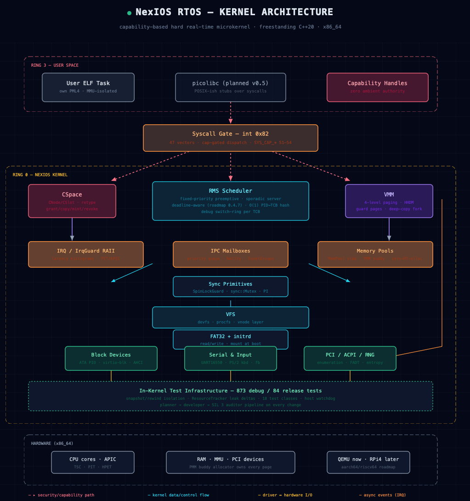

<!-- SEO Metadata: NexIOS is an independent custom operating system project. It is not affiliated with Cisco NX-OS, Cisco IOS, NixOS, or Nexos. Dedicated C++20 x86_64 Hard Real-Time Kernel. -->
<p align="center">
  
</p>

<h1 align="center">NexIOS RTOS</h1>
<p align="center">
  <em>A deterministic, safety-critical real-time operating system built from scratch in freestanding C++20.</em>
</p>
<p align="center">
  <strong>🌐 Project website: <a href="https://nexios-2.jimdosite.com">https://nexios-2.jimdosite.com</a></strong>
</p>

<p align="center">
  <a href="https://github.com/staycool1374-Ger/nexios/actions/workflows/ci.yml"></a>
  
  
  
  
  
  
  
  
</p>

---

# Overview NexIOS

A freestanding C++20 real-time operating system for x86_64 with zero dynamic heap allocation in critical paths and deterministic O(1) scheduling.

Currently a monolithic kernel (47 syscalls via `int 0x82`), actively transitioning toward a capability-based microkernel.

* **Target:** x86_64 (ARM64 & RISC-V in preparation)
* **Language:** Freestanding C++20 (`-fno-exceptions`, `-fno-rtti`, zero `libc`/`libstdc++`)
* **Status:** v0.4.1 — CSpace (Capability-Based Access Control) + Untyped allocator, Memory Protection (MP-1..MP-8), background ELF loader
* **License:** GPLv3

NexIOS RTOS is an independent, ground-up implementation of a real-time operating system.

---

## What's different about NexIOS

**The core design goal of NexIOS is to execute any user application (ELF
binary) as a dedicated, fully isolated user-task — scheduled deterministically,
isolated in its own address space, and sandboxed without re-compiling.**

Most hobby and embedded RTOS projects (FreeRTOS, Zephyr, STK) are **scheduler
libraries**: threads share one address space and any task can corrupt any
other. NexIOS takes the operating-system path:

- **MMU-isolated processes** — every user ELF runs as a dedicated task in its
  own 4-level page-table space with guard pages, scheduled deterministically,
  sandboxed without recompilation.
- **Capability-based security (CSpace)** — tasks hold *capabilities* to kernel
  objects (endpoints, frames, IRQs, Untyped memory). Grant/copy/mint/revoke
  semantics; no ambient authority: a syscall without the matching capability
  fails. Most monolithic kernels check *who you are*; NexIOS checks *what you
  can prove*.
- **Deterministic core** — zero dynamic heap allocation on real-time paths,
  O(1) scheduling decisions, RAII-enforced interrupt windows (`IrqGuard`).
- **AI-orchestrated development process** — every change passes a mandatory
  three-agent pipeline (planner → developer → independent SIL 3 auditor) with
  diff-based audits, in-kernel regression gates (873 debug / 84 release tests),
  and full audit-trail documentation. NexIOS doubles as a long-running case
  study: how far can structured LLM orchestration go in building a
  safety-critical system?

## Where this is going

NexIOS is built for a simple idea: **your application is just an ELF file on
the SD card — the system keeps it running on time, every time.**

Write your control logic in C, C++, or Rust, copy `myapp.elf` onto the storage
medium, boot, done. Your app runs in its own isolated address space on a hard
real-time schedule. If your app crashes, the kernel recovers it — the system
stays up, only the application restarts.

That means a Raspberry Pi-class board plus one ELF file could become a
deterministic controller for things like:

* **Home automation:** shutter/blind control with sun-position logic,
  heating hysteresis, lighting scenes — tasks where "switch within 50 ms of
  trigger" actually matters
* **Garden & greenhouse:** irrigation valve timing, climate control
  ("fan on within 2 s above 28 °C")
* **Robotics & model building:** servo loops on a hard 20 ms raster
* **Rapid prototyping:** drop a new build onto developer boards and test
  real-time behavior without re-flashing the whole system

No other RTOS today combines this workflow — load-and-run an unmodified user
ELF from the filesystem, with deterministic timing guarantees and crash
isolation — with this level of simplicity. That gap is the destination of this
project.

**Honest status:** this is where the journey goes, not where we are today.
The x86_64 kernel core already proves the concept (MMU-isolated processes,
background ELF loader, capability security). The pieces that make the maker
workflow real — ARM board bring-up, end-to-end user-ELF loading from storage,
and automatic fault recovery — are open roadmap items tracked as GitHub
Issues. The road is long, but every step on it is concrete and reachable.

If you have been looking for exactly this kind of system and want to help
test or build it: **this project is GPLv3 open source, and contributors are
welcome.** See [Call for Contributions](#call-for-contributions).

---

## Demo

<p align="center">
  <a href="https://www.youtube.com/watch?v=foApKYTFSlE">
    
  </a>
</p>
<p align="center">
  <em>NexIOS demo — real-time kernel for safety (click to watch on YouTube)</em>
</p>

<p align="center">
  
</p>

---

## Key Features

* **Zero-Allocation Critical Paths:** TCBs, IPC mailboxes (`MessageQueue`, `Notify`, `EventGroup`), and virtual memory metadata rely on pre-allocated slab allocators (`MemPool`).
* **RAII Concurrency Guards:** Scoped guards (`IrqGuard`) statically enforce `cli`/`sti` boundaries at compile time to eliminate dangling critical sections.
* **Rewind-Based Testing:** State-capture (`capture_state()`) and restoration hooks allow an automated test-suite to run inside QEMU via state rewinds without reboots.

---

## Microkernel Transition (In Progress)

* **Phase 7 (v0.7.x):** VFS (`vfsd`) and block I/O (`iocd`) externalized to isolated Ring 3 servers behind IPC gateways.
* **Phase 8 (v0.8.x):** Kernel reduced to scheduler, IPC, page-table manager, and IRQ routing. Shell, init, VFS, and drivers run as capability-bearing Ring 3 servers.

## Roadmap & History

- **Current work:** [GitHub Milestone v0.4.2](https://github.com/staycool1374-Ger/nexios/milestone/1) — open items tracked as Issues.
- **Full backlog:** ~80 aspirational roadmap items as [GitHub Issues](https://github.com/staycool1374-Ger/nexios/issues) (labeled `feature`, grouped by phase).
- **Implementation history (what's already done):** [`prompts/ROADMAP_done.md`](prompts/ROADMAP_done.md) — the complete audit trail of every shipped milestone from v0.3.7 through v0.4.1 (CSpace capability security, KernelObject refcounting, concurrency redesign, lock/safety enforcement, and more), each entry with root-cause analyses, commit ranges, and validated test-gate results.

Full roadmap archived in `prompts/ROADMAP.md` and `prompts/README_done.md`.

---

## Build & Quick Start

### Prerequisites

```bash
sudo apt install build-essential git wget xorriso dosfstools \
    x86_64-linux-gnu-gcc binutils qemu-system-x86
```

### Build & Run

```bash
git clone <repo-url>
cd os
make help           # showing list of usage
make debug          # Debug build
make qemu-iso       # Launch in QEMU with serial console
make release        # Optimised release build (no tests)

# Testing targets (QEMU)
make execute-test x86 debug selftest  # Safe class (CI gate)
make execute-test x86 debug all-1    # First half
make execute-test x86 debug all-2    # Second half
make execute-test x86 debug <class>  # Specific test class

# Renode simulation (multi-arch)
make run-renode RENODE_ARCH=x86_64   # x86_64 via SeaBIOS+ISO
make renode-test          # Renode CI validation
```

### Build Architecture

A detailed architecture diagram is shown above ("What's different about NexIOS");
the interactive SVG version lives in [`docs/nexios-architecture.html`](docs/nexios-architecture.html).

---

## Call for Contributions

NexIOS RTOS is an architectural project first and a feature project second. We are seeking contributions from engineers who like to participate.
If this aligns with your engineering philosophy, open an issue or pull request.

---

## License

NexIOS RTOS is free software: you can redistribute it and/or modify it under the terms of the **GNU General Public License**, either version 3 of the License, or (at your option) any later version. See [`LICENSE.txt`](LICENSE.txt) for the full text.
