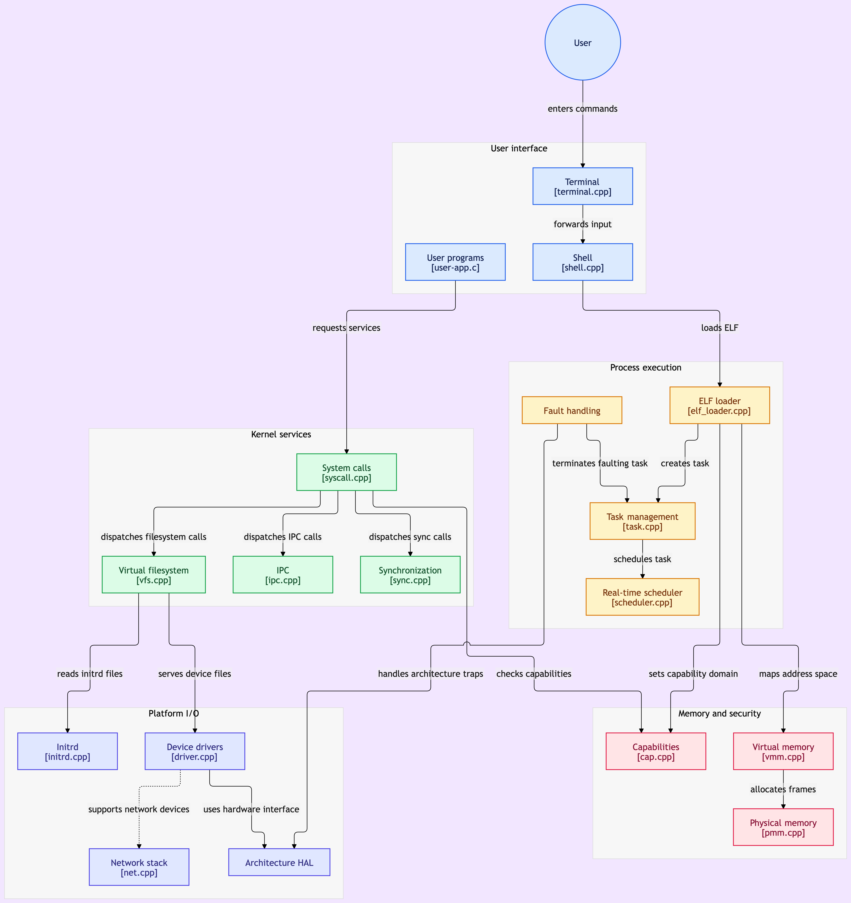
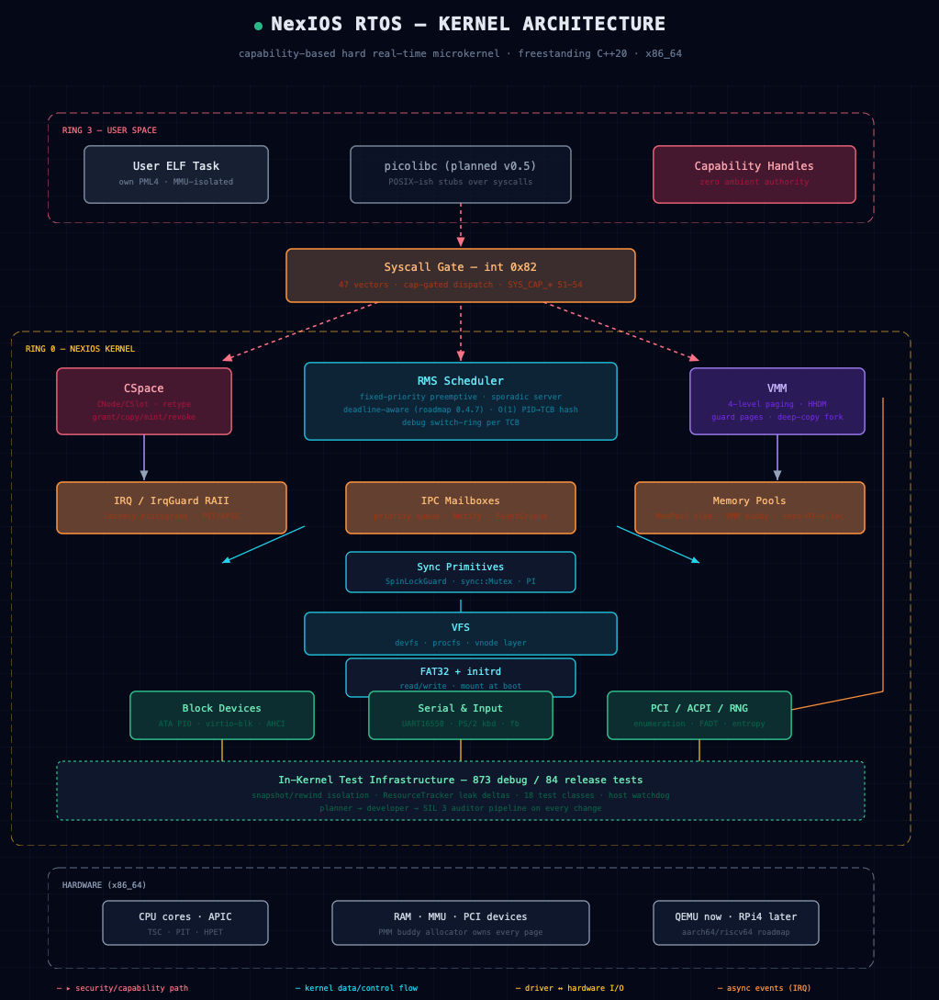

<!-- SEO Metadata: NexIOS is an independent custom operating system project. It is not affiliated with Cisco NX-OS, Cisco IOS, NixOS, or Nexos. Dedicated C++20 x86_64 AARCH64 RISCV64 Hard Real-Time Kernel. -->
<p align="center">
  
</p>

<h1 align="center">NexIOS RTOS</h1>
<p align="center">
  <em>A deterministic, safety-critical real-time operating system built from scratch in freestanding C++20.</em>
</p>
<p align="center">
  <strong>🌐 Project website: <a href="https://nexios-2.jimdosite.com">https://nexios-2.jimdosite.com</a></strong>
</p>

<p align="center">
  <a href="https://github.com/staycool1374-Ger/nexios/actions/workflows/ci.yml"></a>
  
  
  
  
  
  
  
  
</p>

---

## Overview NexIOS

A freestanding C++20 multi-architecture real-time operating system with zero dynamic heap allocation (Slab-Allocator) in critical paths and deterministic O(1) scheduling.

Currently a hybrid kernel actively transitioning toward a capability-based microkernel.

* **Target:** x86_64, ARM64 & RISC-V
* **Language:** Freestanding C++20 (`-fno-exceptions`, `-fno-rtti`, zero `libc`/`libstdc++`)
* **Status:** v0.5.1 — Bring-up Multi-Arch Boot (1610 debug tests, 85 release tests: aarch64/riscv64 production boot, per-arch syscall ABI conformance, EL0 fork smoke, debugd phases 1–2)
* **License:** GPLv3

NexIOS RTOS is an independent, ground-up implementation of a real-time operating system.

---

## Diagram of actual implementation



---

## Who Needs This?

NexIOS combines MMU process isolation and capability-based security (CSpace) with a straightforward workflow:  **your application is just an ELF file on the system — NexIOS keeps it running on time, every time.**

Write your control logic in C, C++, or Rust and execute it directly via the POSIX-compliant NexIOS shell. Applications can be dynamically loaded from storage or secondary media without needing a system reboot. If an application fails, simply reload and restart it. Handy for a rapid application development (RAD) system without re-flashing like: 

* **Robotics & Motion Control:** High-frequency servo and actuator control loops requiring strict sub-millisecond execution windows.
* **Industrial & Home Automation:** Multi-tasking controllers (e.g., climate regulation, energy management, sensor pipelines) where individual services can be updated on the fly without stopping core safety routines.
* **Rapid Edge Prototyping:** Dropping and testing updated user binaries on real-time target hardware without re-flashing the underlying kernel.

If you have been looking for exactly this kind of system and want to help test or build it: **this project is GPLv3 open source, and contributors are welcome.** See [Call for Contributions](#call-for-contributions).

---

## Demo

<p align="center">
  <a href="https://www.youtube.com/watch?v=foApKYTFSlE">
    
  </a>
</p>
<p align="center">
  <em>NexIOS demo — real-time kernel for safety (click to watch on YouTube)</em>
</p>

<p align="center">
  
</p>

---

## Roadmap & History

- **Current work:** [GitHub Milestones](https://github.com/staycool1374-Ger/nexios/milestones) — open items tracked as Issues.
- **Full backlog:** ~80 aspirational roadmap items as [GitHub Issues](https://github.com/staycool1374-Ger/nexios/issues) (labeled `feature`, grouped by phase).

Done roadmap archived in `prompts/README_done.md`.

---

## Recent Release Highlights

### **v0.5.1 — Bring-up Multi-Arch Boot**
* **Three Architectures Boot to Production:** aarch64 and riscv64 join x86_64 with real production boot paths — page-table/HHDM bring-up, PCI discovery, per-arch syscall ABI conformance tests, an EL0 fork smoke test, and riscv64 U-mode user tasks.
* **Kernel Debugger Foundations:** the debugd groundwork lands — kernel debug syscalls (read/write regs/mem, attach), stop-event routing with breakpoint shadows, per-arch stepping, and an RSP parser core with mock-transport tests.

---

## Community, Support & Q&A

Have questions about the architecture, CSpace capabilities, or real-time scheduling guarantees?

* **Q&A Thread:** Check out or participate in our central [Q&A Discussion #189](https://github.com/staycool1374-Ger/nexios/discussions/189).
* **Issue Tracker:** Report bugs or discuss upcoming features on [GitHub Issues](https://github.com/staycool1374-Ger/nexios/issues).
* **Contributing:** Pull requests are welcome! Please read through open roadmap issues before submitting major architectural changes.

---
  
## Build & Quick Start

#### Using Docker (recommended)

```bash
docker pull ghcr.io/staycool1374-ger/nexios-env:v0.5.1
docker run --rm -it ghcr.io/staycool1374-ger/nexios-env:v0.5.1
# inside the container:
make build
make execute-test x86_64 debug debug_syscall
```

Run a gate directly without an interactive shell:

```bash
docker run --rm ghcr.io/staycool1374-ger/nexios-env:v0.5.1 \
    make execute-test x86_64 debug debug_syscall
```

Pin a different snapshot explicitly (default is the image's own tag):

```bash
docker run --rm -it -e NEXIOS_TAG=main ghcr.io/staycool1374-ger/nexios-env:v0.5.1
```
#### Running in QEMU Emulator

* **Interactive Debug Mode (Default x86_64):** Launches the kernel in QEMU with serial debug output active.
  ```bash
  make run-debug-mode
  ```
* **Cross-Architecture Targeting:** Append the target architecture (`x86`, `arm`, or `riscv`) to emulate other platforms:
  ```bash
  make run-release-mode arm    # Boots AArch64 target in QEMU
  make run-release-mode riscv  # Boots RISC-V 64 target in QEMU
  ```
